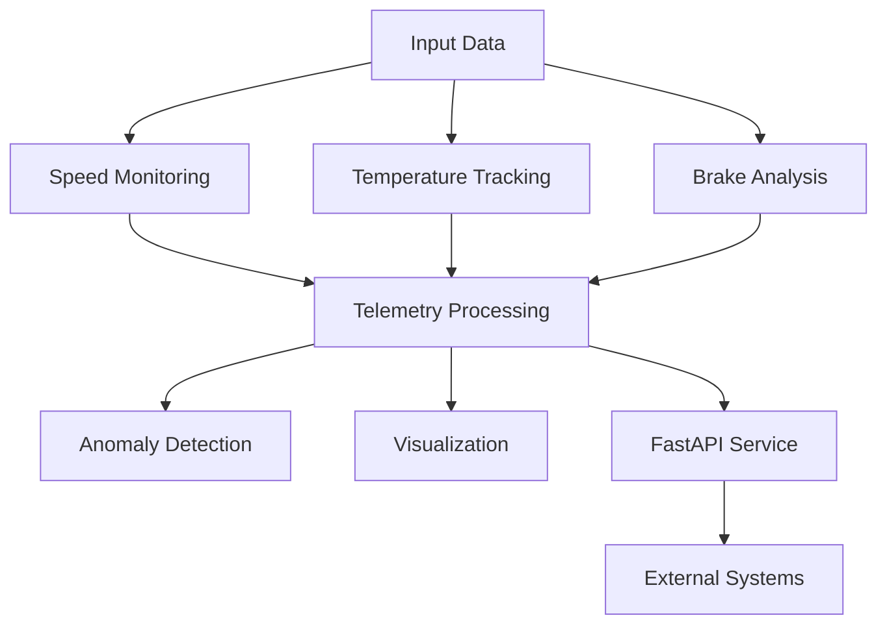

# Vehicle-telemetry-monitoring-system
Python based vehicle telemetry monitoring system that simulates and analyses real time vehicle data  and test it using pytest and BDD test

# ๐Ÿš— Vehicle Telemetry Monitoring System

A Python-based simulation and automation framework for monitoring vehicle telemetry data such as **speed, engine temperature, and brake pressure**, enriched with **data visualization, AI anomaly detection, and REST APIs**.

This project demonstrates how modern automotive systems can be designed, tested, and validated using **automation testing, BDD, and CI/CD pipelines**.

---

## ๐Ÿ“Œ Overview

The system simulates real-time telemetry data from a vehicle and processes it through multiple modules:

- Monitoring and analysis of vehicle parameters
- Visualization of telemetry data
- Detection of anomalies using statistical logic
- Exposure of data via REST APIs
- Automated testing using Pytest and BDD

---

## ๐Ÿงฉ Features

### ๐Ÿš˜ 1. Speed Monitoring
- Calculates average and maximum speed
- Helps evaluate vehicle performance
- Provides input for anomaly detection

---

### ๐ŸŒก๏ธ 2. Engine Temperature Tracking
- Monitors engine temperature values
- Detects overheating conditions
- Supports predictive maintenance

---

### ๐Ÿ›‘ 3. Brake Pressure Analysis
- Analyzes braking force applied
- Simulates braking impact on speed
- Ensures safe braking behavior

---

### ๐Ÿ“Š 4. Telemetry Visualization
- Plots speed and pressure data
- Generates graphical insights
- Saves output as image for reporting

---

### ๐Ÿค– 5. AI-Based Anomaly Detection
- Detects abnormal values using statistical deviation
- Identifies unsafe conditions
- Can be extended to ML-based models

---

### ๐ŸŒ 6. REST API (FastAPI)
- Exposes telemetry data via APIs
- Enables integration with external systems
- Lightweight and high-performance

---

## ๐Ÿ—๏ธ System Architecture



---

## ๐Ÿ“Š Dashboard Visualization

The system generates telemetry plots such as:

- Speed trends
- Brake pressure trends

### ๐Ÿ”น Example Output

> Add your generated image inside `images/plot.png`


---

## ๐Ÿ“ Project Structure

```
vehicle-telemetry-monitoring/
โ”‚
โ”œโ”€โ”€ src/
โ”‚ โ”œโ”€โ”€ speed.py
โ”‚ โ”œโ”€โ”€ temperature.py
โ”‚ โ”œโ”€โ”€ brake.py
โ”‚ โ”œโ”€โ”€ telemetry.py
โ”‚ โ”œโ”€โ”€ anomaly.py
โ”‚ โ””โ”€โ”€ api.py
โ”‚
โ”œโ”€โ”€ tests/ # Pytest tests
โ”œโ”€โ”€ features/ # BDD tests
โ”‚ โ””โ”€โ”€ steps/
โ”‚
โ”œโ”€โ”€ images/ # Output plots
โ”‚ โ””โ”€โ”€ plot.png
โ”‚
โ”œโ”€โ”€ requirements.txt
โ”œโ”€โ”€ README.md
โ””โ”€โ”€ .github/workflows/ # CI/CD pipeline
```

---

## โš™๏ธ Installation

### ๐Ÿ”น 1. Clone Repository

```
git clone https://github.com/your-username/vehicle-telemetry-monitoring.git
cd vehicle-telemetry-monitoring
```

---

### ๐Ÿ”น 2. Install Dependencies

```
pip install -r requirements.txt
```

---

## โ–ถ๏ธ Running the Project

### ๐Ÿ”น Run API Server

```
uvicorn src.api:app --reload
```

Access endpoints:
- http://127.0.0.1:8000/speed
- http://127.0.0.1:8000/health

---

### ๐Ÿ”น Run Pytest

```
pytest -v
```

---

### ๐Ÿ”น Run BDD Tests

```
behave
```

---

## ๐Ÿงช Testing Strategy

### โœ… Unit Testing (Pytest)
- Validates individual modules
- Ensures correctness of logic

### โœ… BDD Testing (Behave)
- Scenario-based validation
- Human-readable test cases

---

## ๐Ÿ”„ CI/CD Pipeline

The project uses GitHub Actions to:
- Automatically run tests on every push
- Validate code quality
- Ensure build stability

---

## ๐Ÿ““ Google Colab Support

You can run this project in Google Colab:

1. Upload files
2. Install dependencies
3. Execute modules interactively

---

## ๐Ÿง  Learning Outcomes

This project helps you understand:

- Automotive telemetry systems
- Automation testing (Pytest + BDD)
- API development using FastAPI
- Data visualization
- AI anomaly detection basics
- CI/CD implementation

---

## ๐Ÿš€ Future Enhancements

- Real-time dashboard (Streamlit/Dash)
- Machine learning-based anomaly detection
- Cloud deployment
- Integration with real vehicle data

---

## ๐Ÿค Contribution

Contributions are welcome!

- Add new features
- Improve test coverage
- Optimize performance

---

## ๐Ÿ“„ License

This project is open-source under the MIT License.

---

## โญ Support

If you like this project:
- โญ Star the repository
- ๐Ÿด Fork it
- ๐Ÿ”— Share it

---

## ๐ŸŽฏ Conclusion

This project demonstrates how modern vehicle telemetry systems can be simulated, monitored, and validated using automation frameworks. By combining real-time data processing, visualization, anomaly detection, and API integration, it provides a strong foundation for building intelligent and scalable automotive monitoring solutions.
